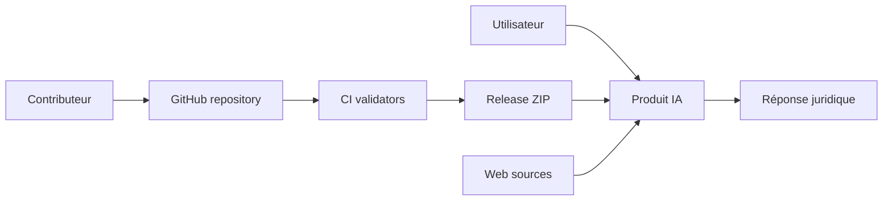

# Threat model du dépôt

## Executive summary

Le projet est un corpus Markdown/JSON/Python destiné à être copié dans des
produits d'IA; il n'expose pas de serveur ni de base de données. Les risques
principaux portent sur l'intégrité du corpus et des releases, l'injection de
contenu distant dans un prompt, la fuite de données confidentielles vers le
fournisseur choisi et la surinterprétation d'une source seulement référencée.

## Scope and assumptions

- Inclus : noyau, profils, domaines, adaptateurs, registre, évaluations,
  validateurs, workflows et archives de release.
- Exclu : fournisseur LLM, compte utilisateur, navigateur, actions configurées
  hors dépôt et environnement de production du consommateur.
- Hypothèses : dépôt public; contributions et tags GitHub sont les vecteurs de
  changement; l'utilisateur peut fournir des documents et données aux produits.
- Questions ouvertes : produit réellement choisi, exposition de documents
  confidentiels, contrôle des droits de publication et épinglage des actions.

## System model

### Primary components

Le noyau est `core/`; les profils et domaines sont documentaires; `sources.json`
oriente la recherche; les validateurs contrôlent la forme; les workflows
valident et publient une archive (`.github/workflows/*.yml`). Aucun runtime n'est
présent.

### Data flows and trust boundaries

- Contributeur -> Git : Markdown, JSONL, Python et YAML; contrôle par revue et CI,
  actions GitHub épinglées par SHA complet, mais branche non protégée.
- GitHub CI -> archive : seuls les fichiers suivis par Git entrent dans le ZIP;
  ordre, timestamp et permissions sont normalisés, sans signature ni provenance
  attestée.
- Utilisateur -> produit IA : prompts et documents; confidentialité, rétention,
  outils et journaux dépendent du fournisseur hors périmètre.
- Page/source distante -> produit IA : contenu non fiable; le noyau demande de
  séparer contenu et instructions (`core/methodology.md:47-64`), sans proxy ni
  sandbox dans ce dépôt.

#### Diagram

## Assets and security objectives

| Asset | Why it matters | Security objective |
| --- | --- | --- |
| Noyau et profils | Déterminent les garde-fous | C/I/A |
| Registre et citations | Risque de fausse autorité | I |
| Documents utilisateur | PII, données RH, secret d'affaires | C/I |
| Clés fournisseur | Accès et coûts hors dépôt | C |
| Workflow et archive | Chaîne de distribution publique | I/A |
| Journaux de recherche | Traçabilité et données personnelles | C/I |

## Attacker model

### Capabilities

Un contributeur malveillant peut proposer un commit, un tag ou une modification
de source; un document distant peut contenir une instruction hostile; un
utilisateur peut fournir des PII ou une fausse référence.

### Non-capabilities

Le dépôt seul ne donne pas accès aux comptes LLM, aux secrets GitHub, aux
documents privés ni à une exécution serveur. Une compromission de ces systèmes
est hors preuve actuelle.

## Entry points and attack surfaces

| Surface | How reached | Trust boundary | Notes | Evidence |
| --- | --- | --- | --- | --- |
| Contribution | PR/commit | contributeur/GitHub | intégrité du corpus | `CONTRIBUTING.md` |
| Release tag | push `v*` | GitHub/CI | publication automatique | `.github/workflows/release.yml:3-30` |
| JSONL/JSON | validation et ingestion | fichier/outil | schéma strict mais sémantique non testée | `tools/validate_*.py` |
| Source web | recherche utilisateur | web/produit IA | prompt injection possible | `core/methodology.md:47-64` |
| Documents | contexte produit | utilisateur/fournisseur | fuite potentielle hors dépôt | `docs/scope-and-safety.md` |

## Top abuse paths

1. Modifier `sources.json` -> faire croire qu'une source a été consultée -> citer
   une règle non vérifiée -> préjudice décisionnel.
2. Ajouter une instruction hostile dans une page -> l'utilisateur la transmet au
   produit -> le modèle ignore ses garde-fous -> citation inventée.
3. Pousser un tag `v*` -> CI utilise une action amont modifiée -> archive altérée
   publiée.
4. Fournir un dossier RH au produit -> fournisseur conserve les données -> fuite
   de PII ou secret d'affaires.
5. Modifier un cas attendu sans harness -> CI passe -> comportement annoncé sans
   preuve.

## Threat model table

| Threat ID | Threat source | Prerequisites | Threat action | Impact | Impacted assets | Existing controls (evidence) | Gaps | Recommended mitigations | Detection ideas | Test associé | Statut du test | Likelihood | Impact severity | Priority |
| --- | --- | --- | --- | --- | --- | --- | --- | --- | --- | --- | --- | --- | --- | --- |
| TM-001 | Contributeur | PR acceptée | Source ou règle trompeuse | fausse analyse | noyau, registre | revue demandée, validateurs | pas de preuve juridique automatisée | revue à deux niveaux, fiche datée | audit des diffs sources | source-hierarchy | DECLARATIF_NON_EXECUTE | medium | high | high |
| TM-002 | Page distante | contenu ingéré | prompt injection | citation ou action non fiable | réponse | séparation prescrite | pas de fetcher/sandbox | traiter contenu comme données, tests runtime | journaliser source et décision | prompt-injection-source, source-instruction-injection | DECLARATIF_NON_EXECUTE | medium | high | high |
| TM-003 | Chaîne CI | tag et action amont | altérer release ou produire des archives divergentes | distribution compromise | archive | SHA complets, permissions minimales, archive déterministe et digest GitHub | pas de signature, SBOM ni provenance attestée; branche non protégée | protéger la branche, ajouter provenance et vérifier le digest publié | vérifier digest et artefact | `create_archive.py --check-reproducible` | EXECUTE_STRUCTURELLEMENT | low | high | medium |
| TM-004 | Utilisateur/fournisseur | document sensible transmis | conserver ou exposer PII | atteinte confidentialité | documents, journaux | minimisation dans la doc | contrôle hors dépôt | politique fournisseur, redaction, DLP | audit rétention et accès | personal-data, pseudonymized-case | DECLARATIF_NON_EXECUTE | medium | high | high |
| TM-005 | Mainteneur | modification d'évaluation | annoncer benchmark fictif | mauvaise confiance | évaluations | validateur de forme | aucun harness | rapporter les runs et sorties | CI exige artefact de test | claims audit, audit reproducibility | DOCUMENTAIRE | medium | medium | medium |
| TM-006 | Page imitant un site officiel | URL ou domaine trompeur | confondre autorité et apparence | preuve juridique erronée | registre, réponse | hiérarchie prescrite dans le noyau | aucun contrôle de domaine/certificat dans le dépôt | vérifier organisme, URL finale et document primaire | journaliser URL finale et organisme | plausible-nonexistent-decision, citation-fidelity | DECLARATIF_NON_EXECUTE | medium | high | high |
| TM-007 | Sources secondaires répétitives | plusieurs pages copient la même erreur | fausse référence amplifiée | décision ou article inventé propagé | citations | exigence de source primaire | pas de détection de circularité | remonter à la source primaire et comparer les passages | graphe des références | secondary-source-conflict, case-law-as-general-rule | DECLARATIF_NON_EXECUTE | medium | high | high |
| TM-008 | Fournisseur ou journal | document sensible soumis | exfiltration ou journalisation involontaire | fuite de données confidentielles | dossiers, journaux, secrets | avertissements de confidentialité | contrôle fournisseur hors dépôt | redaction, politique de rétention, DLP et accès | revue des logs et tests de suppression | personal-data, PRIVACY_AND_CONFIDENTIALITY.md | NON_EXECUTE | medium | high | high |
| TM-009 | Secret injecté dans prompt ou CI | secret présent dans entrée ou log | divulguer token ou cookie | compromission de compte | clés, comptes | recherche de secrets statique | aucune isolation runtime | filtrage, coffre, masquage et interdiction d'entrée | scan de logs et rotation | source-instruction-injection | NON_EXECUTE | low | high | medium |
| TM-010 | Dépendance/action compromise | action ou runner compromis | modifier build ou artefact | release altérée | archive, intégrité | actions officielles épinglées par SHA et permissions explicites | runner hébergé, CLI GitHub et dépendances de service hors contrôle du dépôt | surveiller les SHA, ajouter SBOM et provenance | vérifier digests et attestations | contrôle statique des SHA en CI | EXECUTE_STRUCTURELLEMENT | low | high | medium |
| TM-011 | Mainteneur malveillant | PR ou tag accepté | modifier le skill et ses garde-fous | comportement dangereux distribué | noyau, profils | revue et CI structurelle | pas de revue juridique obligatoire | revue à deux personnes et protection de branche | audit des diffs et release | certainty-pressure, fabricate-citation | DECLARATIF_NON_EXECUTE | medium | high | high |

## Criticality calibration

- Critical : exfiltration confirmée de secrets ou archive signée/consommée
  compromise; aucun cas n'est démontré ici.
- High : citation juridique fausse, fuite de dossier ou modification du noyau
  publiquement distribuée.
- Medium : action CI mutable, validation déclarative ou couverture incomplète.
- Low : défaut documentaire sans effet sur intégrité ou confidentialité.

## Focus paths for security review

| Path | Why it matters | Related Threat IDs |
| --- | --- | --- |
| `core/` | garde-fous et instructions | TM-001, TM-002 |
| `references/sources.json` | autorité et routage | TM-001 |
| `tools/validate_*.py` | contrôles de CI | TM-003, TM-005 |
| `.github/workflows/` | publication et permissions | TM-003 |
| `adapters/` | transfert vers fournisseurs | TM-002, TM-004 |
| `docs/scope-and-safety.md` | limites de confidentialité | TM-004 |

## Notes on use

Les conclusions sont conditionnelles à l'environnement du produit IA. Toute
validation de conformité RGPD, AI Act, secret professionnel ou consultation
juridique doit être faite par un professionnel qualifié; ce dépôt ne suffit pas.
